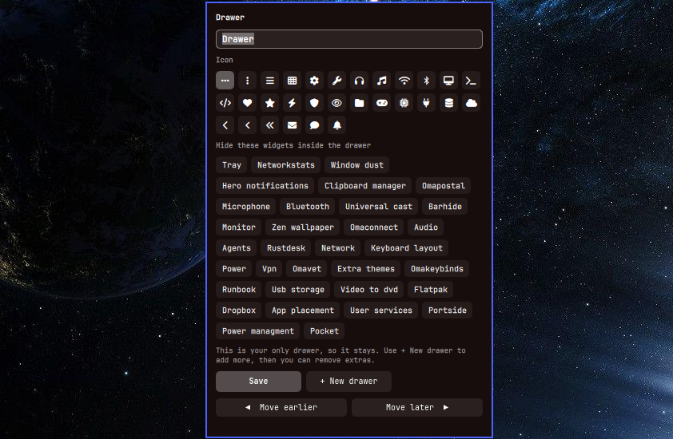

# Omadrawers

Omadrawers adds hover drawers to the Omarchy Quattro bar. Park any bar widgets behind one named
icon that expands in place. Unlimited drawers; hover to open, click the icon to pin.



## Install

```sh
omarchy plugin add https://github.com/qempexe/omarchy-omadrawers.git --enable
```

If it doesn't appear, then:
```sh
omarchy plugin enable io.github.qempexe.omadrawers --section right
```

Optional: put the helper command on your PATH.

```sh
ln -sf ~/.config/omarchy/plugins/io.github.qempexe.omadrawers/bin/omarchy-drawers \
  ~/.local/bin/omarchy-drawers
```

## Usage

Add **Omadrawer** to the bar from the widget list (you can add as many as you like), then:

- **Right-click the icon** to open the editor: type a name, pick an icon, tick the widgets
  to hide inside it, and press **Save**. It applies immediately.
- **Hover** the icon to slide the drawer open; **left-click** pins it open.
- Drag the rows under **Order inside the drawer** to reorder the hidden widgets, then Save.
- **+ New drawer** adds another blank drawer next to this one. Right-click the new one to set it up.
- **◀ ▶** move that drawer one slot along the bar.
- **Empty** puts all of a drawer's widgets back on the bar and keeps the blank drawer.
  **Remove** deletes a blank drawer. Your last drawer can be emptied but never removed.
- Only widgets in the same bar section as the drawer can be hidden in it.

## Before you disable or remove the plugin (important)

**Omadrawers does not restore anything automatically.** Widgets hidden inside a drawer live inside
the drawer's entry in `shell.json`. If the plugin is disabled or removed while a drawer still holds
widgets, the shell can drop that drawer together with the widgets inside it. Do this first:

1. Optional but wise: `cp ~/.config/omarchy/shell.json ~/shell.json.bak`
2. Right-click each drawer and press **Empty**. Check that every widget is back on the bar.
3. Press **Remove** on the extra drawers, one by one, until one empty drawer is left.
4. Now disable or remove the plugin (Super + Space menu, or `omarchy plugin remove io.github.qempexe.omadrawers`).
5. If an empty Drawer entry is still on your bar afterwards, delete it in the bar settings.

Shortcut for steps 2 and 3: run `omarchy-drawers flatten`. It puts every hidden widget back on the
bar and removes all drawers in one go.

Enabling the plugin again gives you a fresh start: add **Drawer** from the widget list and set it up.
Names, icons and contents are not remembered across a disable.

If you removed the plugin while drawers still had widgets in them and something is missing, restore
the previous config (see below) or re-add the widget from the bar settings.

## From a terminal (optional)

```sh
omarchy-drawers new        # pick side, name, icon, widgets
omarchy-drawers edit       # rename, change icon/widgets, delete
omarchy-drawers list
omarchy-drawers add-blank  # add another blank drawer (then right-click it)
omarchy-drawers reorder --key KEY --before|--after
omarchy-drawers flatten    # every widget back on the bar, all drawers removed
omarchy-drawers undo       # restore the previous shell.json
```

Scriptable form:

```sh
omarchy-drawers new --section right --name Media --icon "" --widgets omarchy.audio,omarchy.bluetooth
```

## Recovering from a mistake

Every change made through the editor or `omarchy-drawers` first saves a copy of your config in
`~/.local/state/omarchy-drawers/backups` (last 20 kept, also kept after removal).

- `omarchy-drawers undo` restores the most recent backup.
- To go back further, copy a backup over the config yourself:
  `ls -t ~/.local/state/omarchy-drawers/backups`, then
  `cp ~/.local/state/omarchy-drawers/backups/<file> ~/.config/omarchy/shell.json`.

## What it touches

- Plugin kinds: a headless `service` (gives drawers access to the bar-widget catalogue so they can
  host other widgets, and gives new drawers unique keys) and a `bar-widget`.
- `bin/omarchy-drawers` edits `~/.config/omarchy/shell.json`, with a backup first.
- Parked third-party widgets are added to the `plugins` list so they stay enabled.
- No background service, nothing runs outside the shell and the commands above.
- Requires `jq` (ships with Omarchy). `python3` is used only to give drawers unique keys.
  `gum` is optional (nicer prompts).
- Runs unsandboxed inside the shell process, like all Omarchy plugins.

## Credits

Service and host-bar patterns adapted from TomFaulkner/omarchy-popout-tray (MIT).
